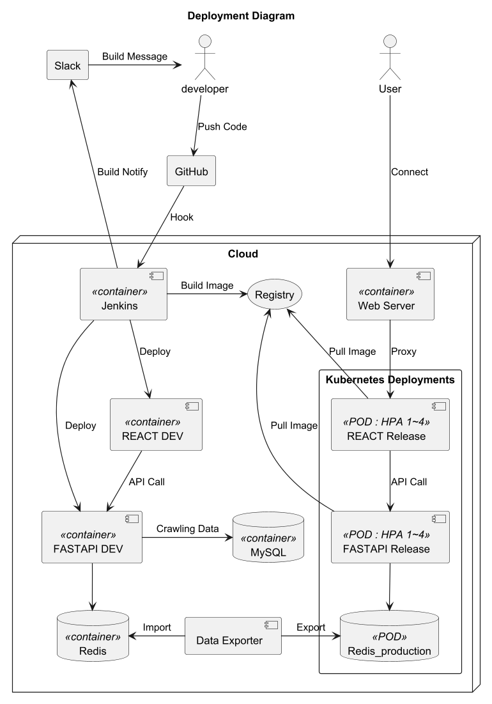

### 내용을 각자 알맞게 수정해주세요.

# 🏫빈 강의실 찾기 프로젝트

---

## 📌 프로젝트 개요

*본 프로젝트는 단국대학교(죽전) 학생 및 교직원들을 대상으로 
시험기간 및 수업과 수업 사이 시간적 여유가 있을 때 
머무를 수 있는 강의실을 조회하는 서비스 개발을 목적으로 한다. *

- **과목**: 오픈소스SW기초
- **분반**: 3분반
- **담당 교수**: 송인식 교수님
- **기간**: 2025. 03. ~ 2025. 06.

---

# 👥 팀 구성 및 역할
- 프론트 
  - 신승호(팀장)
    - 아이디어 구체화 및 UI/UX 설계
    - Figma를 활용한 UI 디자인
    - React 프론트엔드 개발
    	: 강의실 시간표 Page 구현
	    : Navigation Bar 구현
  - 이현승
    - 아이디어 구체화 및 UI/UX 설계
    - React 프론트엔드 빈 강의실 페이지 개발
    - 프론트엔드 의존성 관리
  - 송지효
    - 아이디어 구체화 및 UI/UX 설계
    - React 프론트엔드 개발: 내 시간표 Page 구현현
  
- 백엔드 
  - 김태영
    - 클라우드에 도커 및 쿠버네티스 환경 설정 
    - 도메인 설정 
    - HTTPS 프록시 설정 
    - 개발용 도커 설정 
    - 배포용 Kubernetes 설정(컨트롤러, 서비스, HPA) 
    - 컨테이너 레지스트리 설정
    - 깃허브 레포지토리 및 커뮤니티 관리 - 스크럼, WIKI, 디스커션 관리 
    - 깃허브 커밋 및 히스토리 관리
    - CI/CD 구축 - 깃허브 웹훅과 젠킨스 연동으로 빌드 및 자동 배포 
    - 슬랙 알림 메시지 제공
    - 강의 시간표 크롤링 기능 구현
    - MySQL, Redis 데이터베이스 구축
    - 구축한 데이터베이스와 연동하여 API 제공
    - 관리자 API 인증 처리 (Bearer Token)
    - 보안 및 서버 관리
    - API 서버 캐시 기능 구현
    - HPA 및 캐시 기능의 성능, 부하 테스트 및 모니터링 >> [테스트 결과 링크](k6.md)

---

## ✨ 주요 기능

- 특정 교시에 사용 가능한 빈 강의실 조회
- 특정 교시에 수업 중인 강의실 정보 조회
- 특정 강의실 일주일 간 수업 정보 조회
- 내 시간표 등록 및 강의실 수업 정보 조회

---

## 🖼️ UX/UI 설계 및 사용법
 - 페이지1
 - 페이지2
 - 페이지3
 - 페이지4

---

## 📡 백엔드 API 엔드포인트

| **HTTP 메서드** | **엔드포인트** (*표시는 인증 필요)                                 | **설명**                                   |
|-----------------|--------------------------------------------------------|-------------------------------------------|
| GET             | `/`                                                    | API의 기본 상태를 확인합니다.              |
| POST            | `/set-cache-ttl`*                                      | 캐시 TTL 값을 설정합니다.                  |
| GET             | `/run-crawler`*                                        | 데이터를 크롤링하고 MySQL에 저장합니다.    |
| GET             | `/save-to-redis`*                                      | 데이터를 Redis에 저장합니다.               |
| GET             | `/make-json`*                                          | MySQL 데이터를 JSON 형식으로 반환합니다.   |
| GET             | `/make-json-type1`*                                    | MySQL 데이터를 Type 1 JSON 형식으로 반환합니다. |
| GET             | `/query-classroom-json/{building}/{classroom_id}`      | 특정 강의실 정보를 JSON 형태로 조회합니다. |
| GET             | `/query-classroom-table/{building}/{classroom_id}`     | 특정 강의실 정보를 테이블 형태로 조회합니다. |
| GET             | `/query-building-json/{building_id}`                   | 특정 건물의 모든 강의실 정보를 JSON 형태로 조회합니다. |
| GET             | `/query-building-table/{building_id}`                  | 특정 건물의 모든 강의실 정보를 테이블 형태로 조회합니다. |
| GET             | `/query-classroom-list`                                | 모든 강의실 리스트를 조회합니다.           |
| GET             | `/query-classroom-list/{building_id}`                  | 특정 건물의 강의실 리스트를 조회합니다.    |
| GET             | `/query-building-list`                                 | 모든 건물 리스트를 조회합니다.             |
| GET             | `/query-classroom-period/{building_id}/{day}/{period}` | 특정 요일 특정 교시에 빈 강의실 정보를 조회합니다. |
| GET             | `/query-classroom-period-ext/{building_id}/{day}`      | 특정 요일 모든 교시의 빈 강의실 정보를 조회합니다. |

---

## 🛠️ 기술 스택 (Tech Stack)

| 구분                 | 기술 스택                                                                                                               |
|----------------------|---------------------------------------------------------------------------------------------------------------------|
| **백엔드 개발**       | `Python`, `FastAPI` `MySQL`, `Redis` `requests` (크롤링) `Swagger` (API 문서화)                                  |
| **프론트엔드 개발**   | `React`, `Npm` `HTML`, `CSS` `Axios` (API 호출) `Bootstrap` (스타일링) `Material UI` (스타일링) `Figma` (UI 디자인)         |
| **CI/CD 및 배포 환경**| `Oracle Cloud Infrastructure (OCI)` `OCIR` (Oracle Container Registry) `GitHub`, `Jenkins` `k3s`, `Docker` |
| **버전 관리 및 보안** | `Git` `CORS`, `HTTPS`                                                                                            |
| **테스트 및 모니터링**| `K6` (성능/부하 테스트) `InfluxDB` (성능 데이터 저장) `Grafana` (모니터링) `Postman` (API 테스트)                               |

---

## 🖥️ 배치 다이어그램
<!--https://raw.githubusercontent.com/ellen24k/opensw/master-->

---

## 📂 프로그램 설치 및 실행 방법

### 사전 준비 사항
* Docker, Git, Python, Redis, MySQL latest

### 설치 단계

1.  **저장소 복제**:
* git clone https://github.com/ellen24k/opensw.git

2.  **환경 변수 설정**:
* MYSQL_PASSWORD=your_mysql_password
* CRAWLER_API_KEY=your_crawler_api_key
* RDS_GET_ALL_CLASSROOM_LIST=your_redis_query_value
* .env* 파일에 backend 서버의 URL 설정

3.  **Docker 네트워크 생성 및 설정**:
* docker network create net 으로 docker network 생성
* Redis 및 MySQL IP 설정 값 확인 후 적용
* backend CORS 에 front 도메인 혹은 IP 설정

4.  **빌드 및 실행**:
* Dockerized / Container-based
  * docker-compose -f frontend/docker-compose.yml up -d --build
  * docker-compose -f backend/docker-compose.yml up -d --build
* Local / Native / Host-based
  * frontend
    * npm install
    * npm run start
  * backend
    * python3 -m venv .venv
    * .venv/Scripts/activate
    * pip install -r requirements.txt
    * python -m uvicorn main:app --host 0.0.0.0 --port 8000

### 애플리케이션 접속

* Dockerized / Container-based URL: `http://localhost:13080`
* Local / Native / Host-based URL: `http://localhost:3000`

---

## 📖 용어
- **React**: 사용자 인터페이스를 구축하기 위한 JavaScript 라이브러리.
- **Figma**: UI/UX 디자인 도구로, 프로토타입 및 디자인을 작성하는 데 사용.
- **FastAPI**: Python 기반의 웹 프레임워크로, API 서버를 구축하는 데 사용.
- **Bootstrap**: HTML, CSS, JavaScript로 작성된 프론트엔드 프레임워크로, 반응형 웹 디자인을 지원.
- **Docker**: 애플리케이션을 컨테이너화하여 배포하는 플랫폼.
- **k3s**: 경량화된 Kubernetes 배포판으로, 리소스가 제한된 환경에서 Kubernetes 클러스터를 운영하는 데 사용.
- **Replica**: 동일한 애플리케이션 인스턴스를 여러 개 실행하여 부하를 분산시키는 방식. Kubernetes의 ReplicaSet을 통해 관리.
- **HPA (Horizontal Pod Autoscaler)**: Kubernetes에서 Pod의 수를 자동으로 조정하여 부하를 처리하는 기능.
- **Container Registry**: Docker 이미지를 저장하고 관리하는 레지스트리 서비스.
- **P90/P95 응답 시간**: 요청 중 90% 또는 95%가 해당 시간 이내에 처리된다는 것을 의미하는 지표.
- **K6**: 성능 및 부하 테스트 도구로, JavaScript 기반 스크립트를 사용하여 API 호출을 시뮬레이션.
- **처리율 (Throughput)**: 단위 시간당 처리된 요청의 수.
- **에러율 (Error Rate)**: 전체 요청 중 실패한 요청의 비율.
- **캐시 TTL (Time To Live)**: 캐시 데이터의 유효 기간을 설정하는 값. TTL이 짧으면 데이터 최신성이 높아지고, 길면 시스템 부하가 줄어듦.
- **CORS**: Cross-Origin Resource Sharing의 약자로, 웹 애플리케이션이 다른 도메인에서 리소스를 요청할 수 있도록 허용하는 보안 기능.
- **vCPU**: 가상 CPU의 약자로, 가상화된 환경에서 CPU의 성능을 측정하는 단위.
- **InfluxDB**: 시계열 데이터베이스로, 성능 테스트 데이터를 저장하고 분석하는 데 사용.
- **Grafana**: InfluxDB와 연동하여 실시간 모니터링 대시보드를 제공하는 도구.
- **Redis**: 메모리 기반의 데이터 저장소로, 빠른 데이터 접근을 위해 사용.
- **CI/CD**: Continuous Integration/Continuous Deployment의 약자로, 코드 변경 사항을 자동으로 빌드하고 배포하는 프로세스.
- **Jenkins**: CI/CD 도구로, 자동화된 빌드 및 배포 프로세스를 지원.
- **Swagger**: API 문서화를 위한 도구로, FastAPI와 함께 사용하여 API 엔드포인트를 문서화.
- **Postman**: API 테스트 및 문서화를 위한 도구로, API 요청을 시뮬레이션하고 응답을 확인하는 데 사용.

---

## 📚 레퍼런스
- React 공식 문서: [https://reactjs.org/](https://reactjs.org/)
- Figma 공식 문서: [https://www.figma.com/](https://www.figma.com/)
- Bootstrap 공식 문서: [https://getbootstrap.com/](https://getbootstrap.com/)
- FastAPI 공식 문서: [https://fastapi.tiangolo.com/](https://fastapi.tiangolo.com/)
- Docker 공식 문서: [https://docs.docker.com/](https://docs.docker.com/)
- Kubernetes 공식 문서: [https://kubernetes.io/](https://kubernetes.io/)
- Jenkins 공식 문서: [https://www.jenkins.io/doc/](https://www.jenkins.io/doc/)
- K6 공식 문서: [https://k6.io/docs/](https://k6.io/docs/)
- InfluxDB 공식 문서: [https://www.influxdata.com/](https://www.influxdata.com/)
- Grafana 공식 문서: [https://grafana.com/](https://grafana.com/)
- Redis 공식 문서: [https://redis.io/](https://redis.io/)
