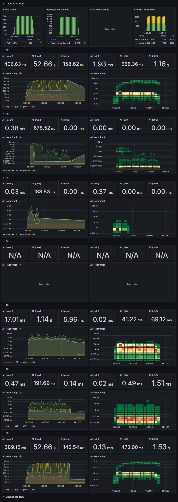
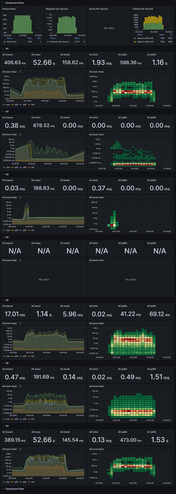
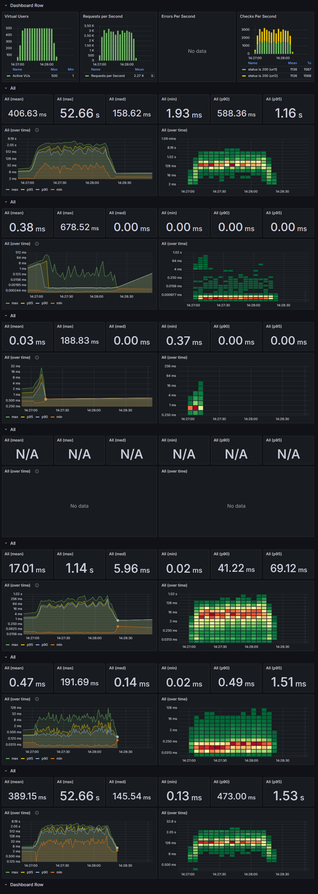
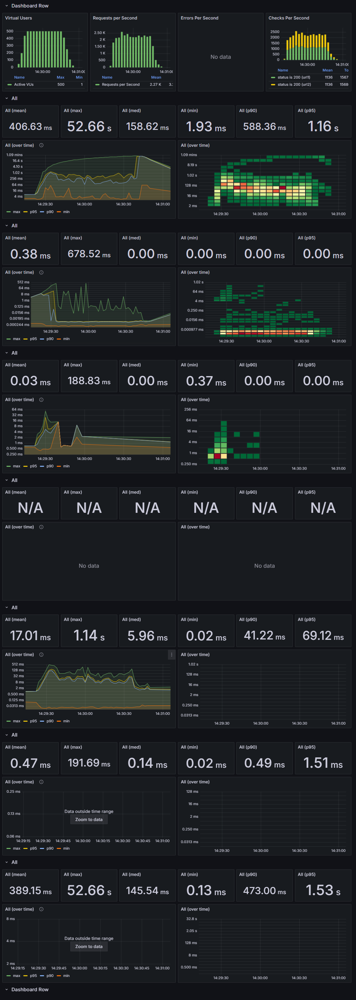
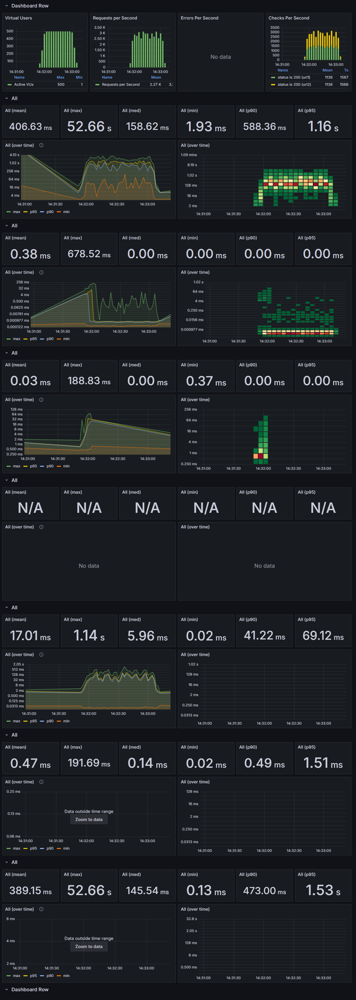
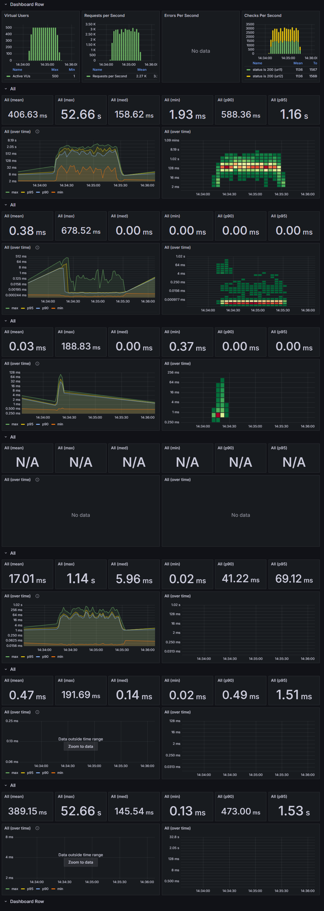
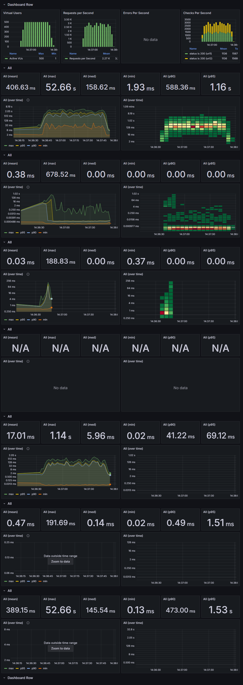

## 성능 및 부하 테스트

### 테스트 개요
- **목적**
    - POD 수(4,3,2,1)에 따른 성능 변화 확인 (TTL 1000ms 고정)
    - 캐시 TTL(1000ms, 100ms, 10ms, 0ms)에 따른 성능 변화 확인 (pod수 4개 고정)

- **테스트 도구**
    - K6: 성능 및 부하 테스트 도구로, JavaScript로 작성된 스크립트를 사용하여 API를 호출하고 성능 데이터를 수집합니다.
    - InfluxDB: K6에서 수집한 성능 데이터를 저장하는 시계열 데이터베이스입니다.
    - Grafana: InfluxDB와 연동하여 실시간 모니터링 대시보드를 구성합니다.

### 테스트 내용

- **테스트 환경**
    - k3s version v1.31.5+k3s1
    - influxdb version 2.7.11
    - grafana version 11.4.0
    - redis 7.4.2
    - ubuntu 24.04.2 LTS
    - 4vCPU, 24GB RAM, aarch64.
    - (800mCPU Limit, 256MiB Memory Limit) * 4 replica
  

- **테스트 조건**
    - 최대 1000 VU가 1초마다 2개의 API(Light API + Heavy API)를 40초동안 호출.

| **테스트 시간 (초)** | **VU (Virtual Users)** | **누적 시간 (초)** |
|----------------|------------------------|---------------|
| 10             | 1~500                  | 10            |
| 60             | 500                    | 70            |
| 10             | 500~0                  | 80            |
 

- **테스트 유형별 데이터 크기**

| **테스트 유형**                                    | **데이터 크기**   |
|-----------------------------------------------|--------------|
| 원본 JSON 데이터                                   | 470 Kbytes   |
| Light API : `/query-classroom-table/1공/401-1` | 460 bytes    |
| Heavy API : `/query-building-table/소프트`       | 35,861 bytes |

### 테스트 결과

#### **Replica 수(1개, 2개, 3개, 4개)에 따른 성능 측정 테스트 결과 (캐시 TTL 10초 고정)**

  
<strong>1 Replica</strong>

<!--https://raw.githubusercontent.com/ellen24k/opensw/master/-->

  
<strong>2 Replica</strong>

  
<strong>3 Replica</strong>

  
<strong>4 Replica</strong>

---

#### **캐시 TTL(0ms, 10ms, 100ms, 1000ms)에 따른 성능 변화 확인 테스트 결과 (Replica 4개 고정)**

  
<strong>캐시 TTL 0ms</strong>

  
<strong>캐시 TTL 10ms</strong>

  
<strong>캐시 TTL 100ms</strong>

  
<strong>캐시 TTL 1000ms</strong>

### 성능 테스트 결과 요약

## 1. POD 설정별 성능 비교

| POD    | 테스트 횟수 (total checks) | 초당 처리 수 (checks/sec) | 평균 응답 시간 (avg) | 90% 응답 시간 (p(90)) | 95% 응답 시간 (p(95)) | 최대 응답 시간 (max) | 실패율 (failure rate) |
|----------|----------------------------|---------------------------|----------------------|----------------------|----------------------|----------------------|-----------------------|
| **1** | 24,704                     | 306.14                    | 953.2ms              | 207.6ms              | 10.33s               | 18.28s               | 0.00%                 |
| **2** | 40,250                     | 497.72                    | 377.48ms             | 579.76ms             | 2.25s                | 7.04s                | 0.00%                 |
| **3** | 43,614                     | 539.61                    | 307.32ms             | 514.21ms             | 1.19s                | 5.64s                | 0.00%                 |
| **4** | 43,174                     | 534.36                    | 316.28ms             | 603.94ms             | 1.15s                | 5.35s                | 0.00%                 |

## 2. TTL 설정별 성능 비교

| TTL    | 테스트 횟수 (total checks) | 초당 처리 수 (checks/sec) | 평균 응답 시간 (avg) | 90% 응답 시간 (p(90)) | 95% 응답 시간 (p(95)) | 최대 응답 시간 (max) | 실패율 (failure rate) |
|----------|----------------------------|---------------------------|----------------------|----------------------|----------------------|----------------------|-----------------------|
| **0** | 33,934                     | 384.44                    | 592.13ms             | 351.69ms             | 705.27ms             | 52.66s               | 0.00%                 |
| **10** | 42,746                     | 528.74                    | 323.69ms             | 674.05ms             | 1s                   | 3.55s                | 0.00%                 |
| **100** | 43,310                    | 534.66                    | 312.6ms              | 631.78ms             | 1.16s                | 4.33s                | 0.00%                 |
| **1000** | 41,892                   | 519.19                    | 340.35ms             | 707.43ms             | 1.13s                | 4.23s                | 0.00%                 |

## 결론
- POD 수 1개는 24,704회, 초당 306.14회 처리로 가장 낮은 성능을 보였습니다.
- POD 수 3개까지는 성능이 증가했으나, 그 이후로는 큰 차이가 없었습니다.
- TTL 0ms(Cache disabled) 는 33,934회, 초당 384.44회 처리, 최대 응답시간 52.66s로 가장 낮은 성능을 보였습니다.
- 캐시가 TTL 10ms로 작동하기만 해도 Redis의 부하가 줄고 성능이 크게 향상되었습니다.

### 한계점
- InfluxDB와 Grafana가 API와 동일한 서버에서 작동하여, 서버 자원 소모가 많아 API 서버가 자원을 온전히 활용하지 못함.

