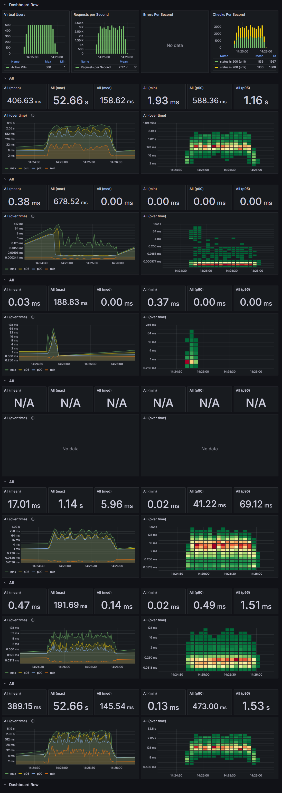

## API 서버 및 캐시 성능 및 부하 테스트

### 테스트 개요
- **목적**
    - Replica 수(1, 2, 3, 4)에 따른 성능 변화 확인 (TTL 1000ms 고정)
    - 캐시 TTL(0ms, 10ms, 100ms, 1000ms)에 따른 성능 변화 확인 (Replica 수 4개 고정)

- **테스트 도구**
    - K6: 성능 및 부하 테스트 도구로, JavaScript로 작성된 스크립트를 사용하여 API를 호출하고 성능 데이터를 수집합니다.
    - InfluxDB: K6에서 수집한 성능 데이터를 저장하는 시계열 데이터베이스입니다.
    - Grafana: InfluxDB와 연동하여 실시간 모니터링 대시보드를 구성합니다.

### 테스트 내용

- **테스트 환경**
    - k3s version v1.31.5+k3s1
    - influxdb version 2.7.11
    - grafana version 11.4.0
    - k6 v1.0.0-rc1
    - redis 7.4.2
    - ubuntu 24.04.2 LTS
    - 4vCPU, 24GB RAM, aarch64.
    - (800mCPU Limit, 256MiB Memory Limit) * 4 replica
  

- **테스트 조건**
    - 최대 500 VU가 1초마다 2개의 API(Light API + Heavy API)를 60초동안 호출.

| **테스트 시간 (초)** | **VU (Virtual Users)** | **누적 시간 (초)** |
|----------------|------------------------|---------------|
| 10             | 1~500                  | 10            |
| 60             | 500                    | 70            |
| 10             | 500~0                  | 80            |
 

- **테스트 유형별 데이터 크기**

| **테스트 유형**                                    | **데이터 크기**   |
|-----------------------------------------------|--------------|
| 원본 JSON 데이터                                   | 470 Kbytes   |
| Light API : `/query-classroom-table/1공/401-1` | 460 bytes    |
| Heavy API : `/query-building-table/소프트`       | 35,861 bytes |

### 테스트 결과

#### **Replica 수(1개, 2개, 3개, 4개)에 따른 성능 측정 테스트 결과 (캐시 TTL 1000ms 고정)**

📋 K6 테스트 결과

🔧 [SET POD = 1] 2025. 04. 27. (일) 14:19:37 KST

█ THRESHOLDS

    http_req_duration
    ✗ 'p(95)<2000' p(95)=10.33s
    ✓ 'p(90)<1000' p(90)=207.6ms

    http_req_failed
    ✓ 'rate<0.01' rate=0.00%

█ TOTAL RESULTS

    checks_total.......................: 24704   306.140114/s
    checks_succeeded...................: 100.00% 24704 out of 24704
    checks_failed......................: 0.00%   0 out of 24704

    ✓ status is 200 (url1)
    ✓ status is 200 (url2)

    HTTP
    http_req_duration.......................................................: avg=953.2ms min=2.1ms med=112.27ms max=18.28s p(90)=207.6ms p(95)=10.33s
      { expected_response:true }............................................: avg=953.2ms min=2.1ms med=112.27ms max=18.28s p(90)=207.6ms p(95)=10.33s
    http_req_failed.........................................................: 0.00%  0 out of 24704
    http_reqs...............................................................: 24704  306.140114/s

    EXECUTION
    iteration_duration......................................................: avg=2.9s    min=1s    med=1.23s    max=32.8s  p(90)=11.33s  p(95)=17.33s
    iterations..............................................................: 12352  153.070057/s
    vus.....................................................................: 26     min=26         max=500
    vus_max.................................................................: 500    min=500        max=500

    NETWORK
    data_received...........................................................: 388 MB 4.8 MB/s
    data_sent...............................................................: 2.4 MB 30 kB/s

🔧 [SET POD = 2] 2025. 04. 27. (일) 14:21:59 KST

█ THRESHOLDS

    http_req_duration
    ✗ 'p(95)<2000' p(95)=2.25s
    ✓ 'p(90)<1000' p(90)=579.76ms

    http_req_failed
    ✓ 'rate<0.01' rate=0.00%

█ TOTAL RESULTS

    checks_total.......................: 40250   497.722509/s
    checks_succeeded...................: 100.00% 40250 out of 40250
    checks_failed......................: 0.00%   0 out of 40250

    ✓ status is 200 (url1)
    ✓ status is 200 (url2)

    HTTP
    http_req_duration.......................................................: avg=377.48ms min=2.14ms med=131.06ms max=7.04s  p(90)=579.76ms p(95)=2.25s
      { expected_response:true }............................................: avg=377.48ms min=2.14ms med=131.06ms max=7.04s  p(90)=579.76ms p(95)=2.25s
    http_req_failed.........................................................: 0.00%  0 out of 40250
    http_reqs...............................................................: 40250  497.722509/s

    EXECUTION
    iteration_duration......................................................: avg=1.75s    min=1s     med=1.27s    max=11.28s p(90)=3.46s    p(95)=4.72s
    iterations..............................................................: 20125  248.861255/s
    vus.....................................................................: 29     min=29         max=500
    vus_max.................................................................: 500    min=500        max=500

    NETWORK
    data_received...........................................................: 631 MB 7.8 MB/s
    data_sent...............................................................: 3.7 MB 46 kB/s

🔧 [SET POD = 3] 2025. 04. 27. (일) 14:24:20 KST

█ THRESHOLDS

    http_req_duration
    ✓ 'p(95)<2000' p(95)=1.19s
    ✓ 'p(90)<1000' p(90)=514.21ms

    http_req_failed
    ✓ 'rate<0.01' rate=0.00%

█ TOTAL RESULTS

    checks_total.......................: 43614   539.613127/s
    checks_succeeded...................: 100.00% 43614 out of 43614
    checks_failed......................: 0.00%   0 out of 43614

    ✓ status is 200 (url1)
    ✓ status is 200 (url2)

    HTTP
    http_req_duration.......................................................: avg=307.32ms min=1.94ms med=150.23ms max=5.64s p(90)=514.21ms p(95)=1.19s
      { expected_response:true }............................................: avg=307.32ms min=1.94ms med=150.23ms max=5.64s p(90)=514.21ms p(95)=1.19s
    http_req_failed.........................................................: 0.00%  0 out of 43614
    http_reqs...............................................................: 43614  539.613127/s

    EXECUTION
    iteration_duration......................................................: avg=1.61s    min=1s     med=1.32s    max=9.34s p(90)=2.4s     p(95)=3.66s
    iterations..............................................................: 21807  269.806563/s
    vus.....................................................................: 26     min=26         max=500
    vus_max.................................................................: 500    min=500        max=500

    NETWORK
    data_received...........................................................: 684 MB 8.5 MB/s
    data_sent...............................................................: 4.0 MB 50 kB/s

🔧 [SET POD = 4] 2025. 04. 27. (일) 14:26:41 KST

█ THRESHOLDS

    http_req_duration
    ✓ 'p(95)<2000' p(95)=1.15s
    ✓ 'p(90)<1000' p(90)=603.94ms

    http_req_failed
    ✓ 'rate<0.01' rate=0.00%

█ TOTAL RESULTS

    checks_total.......................: 43174   534.362768/s
    checks_succeeded...................: 100.00% 43174 out of 43174
    checks_failed......................: 0.00%   0 out of 43174

    ✓ status is 200 (url1)
    ✓ status is 200 (url2)

    HTTP
    http_req_duration.......................................................: avg=316.28ms min=2.15ms med=189.63ms max=5.35s p(90)=603.94ms p(95)=1.15s
      { expected_response:true }............................................: avg=316.28ms min=2.15ms med=189.63ms max=5.35s p(90)=603.94ms p(95)=1.15s
    http_req_failed.........................................................: 0.00%  0 out of 43174
    http_reqs...............................................................: 43174  534.362768/s

    EXECUTION
    iteration_duration......................................................: avg=1.63s    min=1s     med=1.41s    max=8.37s p(90)=2.42s    p(95)=3.13s
    iterations..............................................................: 21587  267.181384/s
    vus.....................................................................: 23     min=23         max=500
    vus_max.................................................................: 500    min=500        max=500

    NETWORK
    data_received...........................................................: 677 MB 8.4 MB/s
    data_sent...............................................................: 4.0 MB 50 kB/s

✅ 모든 테스트 완료: 2025. 04. 27. (일) 14:29:03 KST

#### Grafana 테스트 결과 그래프

  
<strong>1 Replica</strong>

<!--https://raw.githubusercontent.com/ellen24k/opensw/master/-->

  
<strong>2 Replica</strong>

  
<strong>3 Replica</strong>

  
<strong>4 Replica</strong>

---

#### **캐시 TTL(0ms, 10ms, 100ms, 1000ms)에 따른 성능 변화 확인 테스트 결과 (Replica 4개 고정)**

📋 K6 테스트 결과

🔧 [SET TTL = 0] 2025. 04. 27. (일) 14:29:03 KST

█ THRESHOLDS

    http_req_duration
    ✓ 'p(95)<2000' p(95)=705.27ms
    ✓ 'p(90)<1000' p(90)=351.69ms

    http_req_failed
    ✓ 'rate<0.01' rate=0.00%

█ TOTAL RESULTS

    checks_total.......................: 33934   384.442067/s
    checks_succeeded...................: 100.00% 33934 out of 33934
    checks_failed......................: 0.00%   0 out of 33934

    ✓ status is 200 (url1)
    ✓ status is 200 (url2)

    HTTP
    http_req_duration.......................................................: avg=592.13ms min=2.24ms med=67.51ms max=52.66s p(90)=351.69ms p(95)=705.27ms
      { expected_response:true }............................................: avg=592.13ms min=2.24ms med=67.51ms max=52.66s p(90)=351.69ms p(95)=705.27ms
    http_req_failed.........................................................: 0.00%  0 out of 33934
    http_reqs...............................................................: 33934  384.442067/s

    EXECUTION
    iteration_duration......................................................: avg=2.18s    min=1s     med=1.14s   max=1m10s  p(90)=1.83s    p(95)=2.36s   
    iterations..............................................................: 16967  192.221033/s
    vus.....................................................................: 11     min=11         max=500
    vus_max.................................................................: 500    min=500        max=500

    NETWORK
    data_received...........................................................: 532 MB 6.0 MB/s
    data_sent...............................................................: 3.2 MB 36 kB/s

🔧 [SET TTL = 10] 2025. 04. 27. (일) 14:31:32 KST

█ THRESHOLDS

    http_req_duration
    ✓ 'p(95)<2000' p(95)=1s
    ✓ 'p(90)<1000' p(90)=674.05ms

    http_req_failed
    ✓ 'rate<0.01' rate=0.00%

█ TOTAL RESULTS

    checks_total.......................: 42746   528.736782/s
    checks_succeeded...................: 100.00% 42746 out of 42746
    checks_failed......................: 0.00%   0 out of 42746

    ✓ status is 200 (url1)
    ✓ status is 200 (url2)

    HTTP
    http_req_duration.......................................................: avg=323.69ms min=2.14ms med=216.55ms max=3.55s p(90)=674.05ms p(95)=1s   
      { expected_response:true }............................................: avg=323.69ms min=2.14ms med=216.55ms max=3.55s p(90)=674.05ms p(95)=1s   
    http_req_failed.........................................................: 0.00%  0 out of 42746
    http_reqs...............................................................: 42746  528.736782/s

    EXECUTION
    iteration_duration......................................................: avg=1.65s    min=1s     med=1.47s    max=5.81s p(90)=2.36s    p(95)=2.81s
    iterations..............................................................: 21373  264.368391/s
    vus.....................................................................: 27     min=27         max=500
    vus_max.................................................................: 500    min=500        max=500

    NETWORK
    data_received...........................................................: 670 MB 8.3 MB/s
    data_sent...............................................................: 4.0 MB 49 kB/s

🔧 [SET TTL = 100] 2025. 04. 27. (일) 14:33:53 KST

█ THRESHOLDS

    http_req_duration
    ✓ 'p(95)<2000' p(95)=1.16s
    ✓ 'p(90)<1000' p(90)=631.78ms

    http_req_failed
    ✓ 'rate<0.01' rate=0.00%

█ TOTAL RESULTS

    checks_total.......................: 43310   534.656938/s
    checks_succeeded...................: 100.00% 43310 out of 43310
    checks_failed......................: 0.00%   0 out of 43310

    ✓ status is 200 (url1)
    ✓ status is 200 (url2)

    HTTP
    http_req_duration.......................................................: avg=312.6ms min=2.06ms med=191.29ms max=4.33s p(90)=631.78ms p(95)=1.16s
      { expected_response:true }............................................: avg=312.6ms min=2.06ms med=191.29ms max=4.33s p(90)=631.78ms p(95)=1.16s
    http_req_failed.........................................................: 0.00%  0 out of 43310
    http_reqs...............................................................: 43310  534.656938/s

    EXECUTION
    iteration_duration......................................................: avg=1.62s   min=1s     med=1.41s    max=7.79s p(90)=2.43s    p(95)=2.96s
    iterations..............................................................: 21655  267.328469/s
    vus.....................................................................: 1      min=1          max=500
    vus_max.................................................................: 500    min=500        max=500

    NETWORK
    data_received...........................................................: 679 MB 8.4 MB/s
    data_sent...............................................................: 4.0 MB 49 kB/s

🔧 [SET TTL = 1000] 2025. 04. 27. (일) 14:36:15 KST

█ THRESHOLDS

    http_req_duration
    ✓ 'p(95)<2000' p(95)=1.13s
    ✓ 'p(90)<1000' p(90)=707.43ms

    http_req_failed
    ✓ 'rate<0.01' rate=0.00%

█ TOTAL RESULTS

    checks_total.......................: 41892   519.190511/s
    checks_succeeded...................: 100.00% 41892 out of 41892
    checks_failed......................: 0.00%   0 out of 41892

    ✓ status is 200 (url1)
    ✓ status is 200 (url2)

    HTTP
    http_req_duration.......................................................: avg=340.35ms min=1.92ms med=219.39ms max=4.23s p(90)=707.43ms p(95)=1.13s
      { expected_response:true }............................................: avg=340.35ms min=1.92ms med=219.39ms max=4.23s p(90)=707.43ms p(95)=1.13s
    http_req_failed.........................................................: 0.00%  0 out of 41892
    http_reqs...............................................................: 41892  519.190511/s

    EXECUTION
    iteration_duration......................................................: avg=1.68s    min=1s     med=1.48s    max=7.66s p(90)=2.46s    p(95)=2.99s
    iterations..............................................................: 20946  259.595255/s
    vus.....................................................................: 30     min=30         max=500
    vus_max.................................................................: 500    min=500        max=500

    NETWORK
    data_received...........................................................: 657 MB 8.1 MB/s
    data_sent...............................................................: 3.9 MB 48 kB/s

✅ 모든 테스트 완료: 2025. 04. 27. (일) 14:38:36 KST

#### Grafana 테스트 결과 그래프

  
<strong>캐시 TTL 0ms</strong>

  
<strong>캐시 TTL 10ms</strong>

  
<strong>캐시 TTL 100ms</strong>

  
<strong>캐시 TTL 1000ms</strong>

### 성능 테스트 결과 요약

## 1. POD 설정별 성능 비교

| POD    | 테스트 횟수 (total checks) | 초당 처리 수 (checks/sec) | 평균 응답 시간 (avg) | 90% 응답 시간 (p(90)) | 95% 응답 시간 (p(95)) | 최대 응답 시간 (max) | 실패율 (failure rate) |
|----------|----------------------------|---------------------------|----------------------|----------------------|----------------------|----------------------|-----------------------|
| **1** | 24,704                     | 306.14                    | 953.2ms              | 207.6ms              | 10.33s               | 18.28s               | 0.00%                 |
| **2** | 40,250                     | 497.72                    | 377.48ms             | 579.76ms             | 2.25s                | 7.04s                | 0.00%                 |
| **3** | 43,614                     | 539.61                    | 307.32ms             | 514.21ms             | 1.19s                | 5.64s                | 0.00%                 |
| **4** | 43,174                     | 534.36                    | 316.28ms             | 603.94ms             | 1.15s                | 5.35s                | 0.00%                 |

## 2. TTL 설정별 성능 비교

| TTL    | 테스트 횟수 (total checks) | 초당 처리 수 (checks/sec) | 평균 응답 시간 (avg) | 90% 응답 시간 (p(90)) | 95% 응답 시간 (p(95)) | 최대 응답 시간 (max) | 실패율 (failure rate) |
|----------|----------------------------|---------------------------|----------------------|----------------------|----------------------|----------------------|-----------------------|
| **0** | 33,934                     | 384.44                    | 592.13ms             | 351.69ms             | 705.27ms             | 52.66s               | 0.00%                 |
| **10** | 42,746                     | 528.74                    | 323.69ms             | 674.05ms             | 1s                   | 3.55s                | 0.00%                 |
| **100** | 43,310                    | 534.66                    | 312.6ms              | 631.78ms             | 1.16s                | 4.33s                | 0.00%                 |
| **1000** | 41,892                   | 519.19                    | 340.35ms             | 707.43ms             | 1.13s                | 4.23s                | 0.00%                 |

## 결론
- POD 수 1개는 24,704회, 초당 306.14회 처리로 가장 낮은 성능을 보였습니다.
- POD 수 3개까지는 성능이 증가했으나, 그 이후로는 큰 차이가 없었습니다.
- TTL 0ms(Cache disabled) 는 33,934회, 초당 384.44회 처리, 최대 응답시간 52.66s로 가장 낮은 성능을 보였습니다.
- 캐시가 TTL 10ms로 작동하기만 해도 Redis의 부하가 줄고 성능이 크게 향상되었습니다.

### 한계점
- InfluxDB와 Grafana가 API와 동일한 서버에서 작동하여 API 서버가 자원을 온전히 활용하지 못함.
- 서버에서 다른 여러 서비스가 작동 중 이므로 결과에 영향을 줌.

